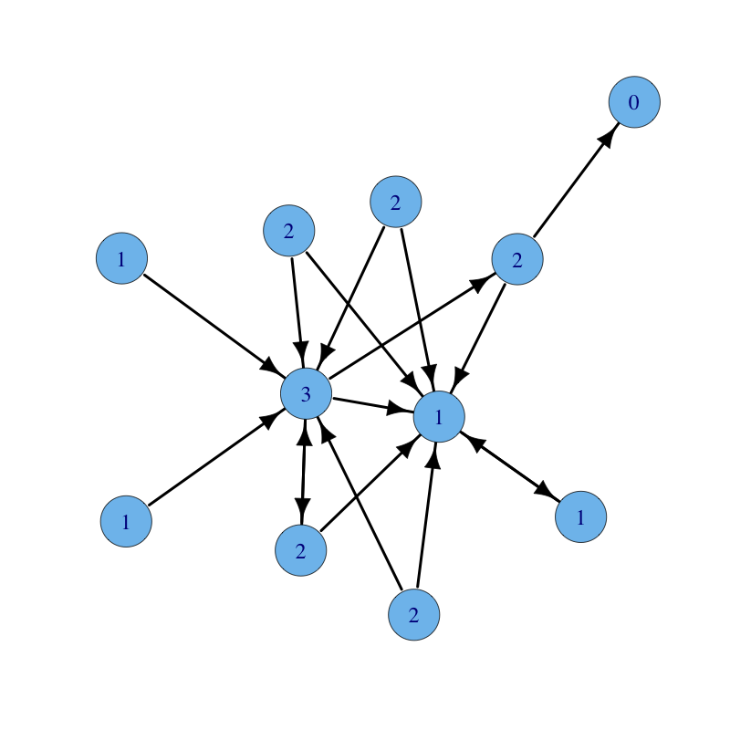
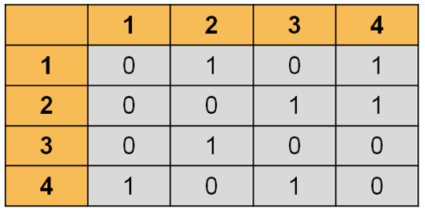
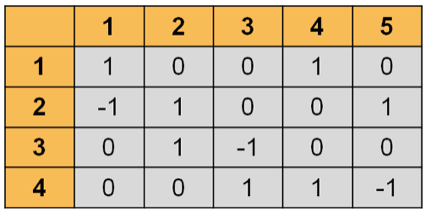
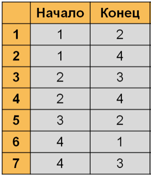
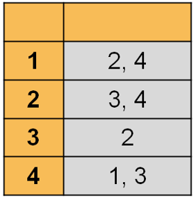

# Grapher
CLI tool that works with graphs



# Features

- Storage and displaying graphs as:
  - [Adjacency matrix](https://en.wikipedia.org/wiki/Adjacency_matrix)
  - [Incidence matrix](https://en.wikipedia.org/wiki/Incidence_matrix)
  - [Adjacency list](https://en.wikipedia.org/wiki/Adjacency_list)
  - [Edge list](https://en.wikipedia.org/wiki/Edge_list)
- Counting Degree, Indegree, Outdegree, Edges, Arcs
- Input and output from console or file

# Usage

**There is no data validation, so beware of incorrect input!**

- Input from console and file are identical
- Input file (_input.txt_), Output file (_output.txt_)


#### Adjacency matrix

```
4
0 1 0 1
0 0 1 1
0 1 0 0
1 0 1 0
```

#### Incidence matrix

```
4 5
1 0 0 1 0
-1 1 0 0 1
0 1 -1 0 0
0 0 1 1 -1
```

#### Edge list

```
7
1 2
1 4
2 3
2 4
3 2
4 1
4 3
```

#### Adjacency list

```
4
2 2 4
2 3 4
1 2
2 1 3
```

## Contributing

Bug reports and/or pull requests are welcome


## License

The repository is available as open source under the terms of the [Apache License, Version 2.0](https://opensource.org/licenses/Apache-2.0)
